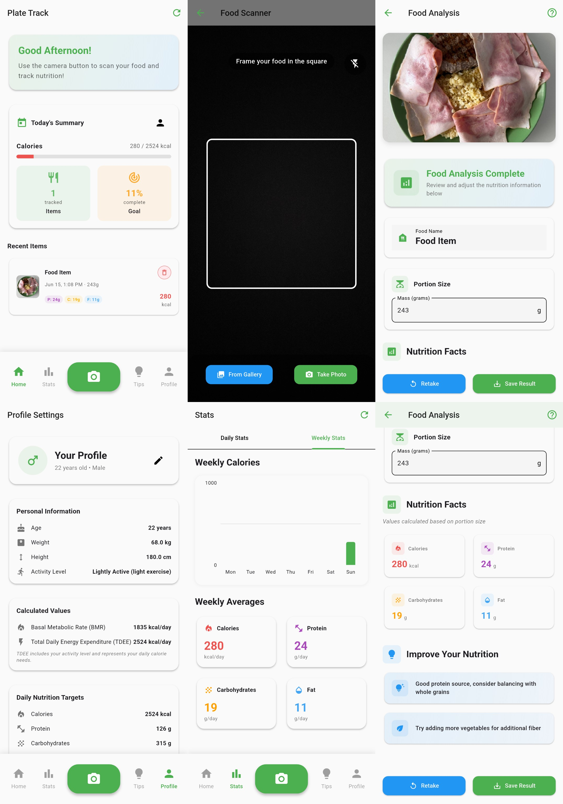

# 🍽️ Plate Track AI

An intelligent Flutter-based nutrition tracking app that uses AI-powered image recognition to analyze food and provide detailed nutritional information. Simply take a photo of your meal and get instant nutrition facts along with personalized dietary recommendations.

## ✨ Features

### 🤖 AI-Powered Food Recognition
- **Smart Food Analysis**: Advanced TensorFlow Lite model for accurate food recognition
- **Nutrition Extraction**: Automatically calculates calories, protein, carbohydrates, and fat content
- **Portion Size Detection**: Intelligent mass estimation for accurate nutritional values
- **Camera & Gallery Support**: Capture photos directly or select from your gallery

### 📊 Comprehensive Nutrition Tracking
- **Daily Dashboard**: Real-time overview of your daily nutrition goals and progress
- **Interactive Charts**: Beautiful visualizations showing calorie intake and nutrient breakdown
- **Weekly Analytics**: Track your nutrition trends over time with detailed statistics
- **Goal Tracking**: Monitor progress against personalized daily nutrition targets

### 👤 Personalized User Profiles
- **BMR Calculation**: Automatic Basal Metabolic Rate calculation based on your personal data
- **TDEE Estimation**: Total Daily Energy Expenditure based on activity level
- **Custom Nutrition Targets**: Personalized calorie, protein, carb, and fat goals
- **Multiple Activity Levels**: From sedentary to extremely active lifestyle support

### 💡 Smart Recommendations
- **Personalized Tips**: AI-driven dietary suggestions based on your eating patterns
- **Nutrition Insights**: Weekly analysis of your nutritional intake
- **Balanced Diet Guidance**: Recommendations for achieving optimal macro distribution
- **Hydration & Health Tips**: General wellness advice to complement your nutrition goals

### 🎨 Modern User Interface
- **Material Design 3**: Clean, intuitive interface following Google's latest design principles
- **Dark/Light Theme**: Automatic theme switching based on system preferences
- **Responsive Design**: Optimized for various screen sizes and orientations
- **Smooth Animations**: Engaging user experience with fluid transitions

## 📱 Screenshots



## 🛠️ Tech Stack

### Frontend
- **Flutter** 3.29.3 - Cross-platform mobile development framework
- **Dart** - Programming language optimized for mobile development

### AI & Machine Learning
- **TensorFlow Lite** - On-device machine learning for food recognition
- **Custom ML Model** - Trained model for nutrition analysis (`image2nutrition.tflite`)

### State Management & Storage
- **Provider** - Lightweight state management solution
- **Hive** - Fast, lightweight NoSQL database for local storage
- **Shared Preferences** - Simple key-value storage for user settings

### UI Components & Visualization
- **FL Chart** - Beautiful, animated charts for nutrition visualization
- **Google Fonts** - Custom typography for enhanced visual appeal
- **Material Design 3** - Modern UI components and theming

### Camera & Image Processing
- **Camera Plugin** - Native camera integration with flash controls
- **Image Picker** - Gallery selection and image handling
- **Image Processing** - Advanced image preprocessing for ML model

## 🚀 Getting Started

### Prerequisites
- Flutter SDK 3.29.3
- Dart SDK 3.0+
- Android Studio / VS Code with Flutter extensions
- iOS development setup (for iOS builds)

### Installation

1. **Clone the repository**
   ```bash
   git clone https://github.com/dant4ick/plate_track_ai.git
   cd plate_track_ai
   ```

2. **Install dependencies**
   ```bash
   flutter pub get
   ```

3. **Generate necessary files**
   ```bash
   flutter packages pub run build_runner build
   ```

4. **Run the app**
   ```bash
   flutter run
   ```

### Build for Production

**Android APK:**
```bash
flutter build apk --release
```

**iOS (requires macOS):**
```bash
flutter build ios --release
```

## 🏗️ Project Structure

```
lib/
├── core/
│   ├── constants/        # App constants and strings
│   ├── services/         # Business logic and API services
│   ├── themes/          # App theming and styling
│   └── utils/           # Utility functions
├── features/
│   ├── dashboard/       # Home screen and daily overview
│   ├── food_recognition/ # Camera and AI recognition
│   ├── nutrition_stats/ # Charts and analytics
│   ├── recommendations/ # AI-powered suggestions
│   ├── profile/         # User profile management
│   └── user_setup/      # Onboarding and profile creation
├── shared/
│   ├── models/          # Data models and Hive adapters
│   └── widgets/         # Reusable UI components
└── main.dart           # App entry point
```

## 🎯 Key Features Deep Dive

### AI Food Recognition Pipeline
1. **Image Capture**: High-quality photo capture with camera controls
2. **Preprocessing**: Image optimization for ML model input
3. **AI Analysis**: TensorFlow Lite model processes the image
4. **Nutrition Calculation**: Converts model output to nutritional values
5. **User Validation**: Editable results for accuracy improvement

### Nutrition Tracking System
- **Real-time Progress Bars**: Visual representation of daily goal progress
- **Macro Breakdown**: Detailed protein, carbs, and fat distribution
- **Historical Data**: Weekly and monthly nutrition trends
- **Smart Recommendations**: Personalized tips based on eating patterns

### Profile & Goal Setting
- **BMR Formula**: Uses Mifflin-St Jeor equation for accurate calculations
- **Activity Multipliers**: Precise TDEE calculation based on lifestyle
- **Macro Distribution**: Customizable protein/carb/fat ratios
- **Goal Tracking**: Visual progress indicators for motivation

## 🔧 Configuration

### ML Model Setup
The app includes a pre-trained TensorFlow Lite model (`assets/ml/image2nutrition.tflite`) optimized for mobile devices. The model estimates nutritional content.

### Database Schema
Hive boxes store:
- **Food Items**: Nutrition data with timestamps
- **User Profiles**: Personal information and goals
- **Settings**: App preferences and configurations

## 🤝 Contributing

We welcome contributions! Please follow these steps:

1. Fork the repository
2. Create a feature branch (`git checkout -b feature/amazing-feature`)
3. Commit your changes (`git commit -m 'Add amazing feature'`)
4. Push to the branch (`git push origin feature/amazing-feature`)
5. Open a Pull Request

### Development Guidelines
- Follow Flutter/Dart best practices
- Maintain consistent code formatting
- Add tests for new features
- Update documentation as needed

## 📄 License

This project is licensed under the MIT License - see the [LICENSE](LICENSE) file for details.

## 🙋‍♂️ Support

For support, questions, or suggestions:
- Create an [Issue](https://github.com/dant4ick/plate_track_ai/issues)

## 🎉 Acknowledgments

- [Nutrition5k](https://github.com/google-research-datasets/Nutrition5k)

---

<div align="center">
  <p>Made with ❤️ and Flutter</p>
  <p>
    <a href="#-plate-track-ai">⬆️ Back to top</a>
  </p>
</div>
